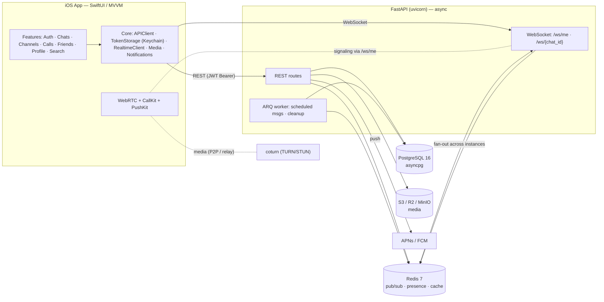

# Siberia

**A full-stack, Telegram-class messenger — native SwiftUI iOS client on top of an async FastAPI backend.**

Real-time chat, group chats, broadcast channels, media sharing, voice/video calls (WebRTC + CallKit), TOTP two-factor auth, and push notifications — designed as a horizontally scalable system with Redis pub/sub fan-out and a monotonic per-chat sync sequence for reliable catch-up after reconnect.

<p>
  
  
  
  
  
  
  
  
  
  
</p>

---

## Overview

Siberia is a private-messaging platform built end to end: a native **iOS app** (Swift / SwiftUI, MVVM, organized as `App` / `Core` / `Features`) talking to an **asynchronous FastAPI backend** backed by **PostgreSQL** (async, `asyncpg`), **Redis** (pub/sub + presence + cache), and **S3-compatible object storage** for media.

The system is designed around a few load-bearing ideas:

- **JWT sessions bound to a device.** Access + refresh tokens, one session per `device_id`, strict refresh-token rotation with reuse detection, and a Redis-backed revocation blacklist.
- **A monotonic `sync_seq` per chat.** Every state change (new message, edit, delete, read receipt, membership change, reaction, pin) is appended to a per-chat update log with an increasing sequence number. On reconnect the client calls `GET /chats/{id}/sync?after_seq=N` and deterministically catches up — WebSocket delivery is an optimization, not the source of truth.
- **Redis pub/sub for horizontal scale.** Real-time events are published to `chat:{id}` / `user:{id}` channels so multiple API instances stay in sync without sticky sessions.
- **WebRTC calls with the existing socket as the signaling channel.** 1-to-1 voice/video runs peer-to-peer (STUN, optional self-hosted coturn TURN relay), with CallKit + PushKit VoIP integration so incoming calls wake a locked device.

## Features

**Messaging**
- 1-to-1 private chats, group chats (owner / admin / member roles), and broadcast channels (public/private, subscriber role)
- Rich messages: replies, forwards, edits with full edit history, soft delete, emoji reactions, `@username` mentions, pinned messages
- Media: images, video, voice messages, video notes ("circles"), and documents via S3-compatible storage with server-side thumbnails and presigned URLs
- Scheduled ("send later") messages delivered by an ARQ background worker, per-chat drafts, and Saved Messages
- Idempotent sends via `client_message_id`; offline message cache and a pending-outgoing queue on the client

**Real-time**
- Per-chat and personal (`/ws/me`) WebSocket channels with heartbeat, exponential-backoff reconnect, and gap recovery through `sync`
- Live typing indicators (server-throttled), read receipts (per-user in groups), and online/last-seen presence broadcast to friends and DM partners

**Calls**
- 1-to-1 voice and video calls over WebRTC (`stasel/WebRTC`), signaled through `/ws/me`
- Native CallKit UI, PushKit VoIP wakeups, and a coturn TURN deployment template for NAT traversal

**Accounts & security**
- Email/password registration with 6-digit email verification (rate-limited with lockout)
- TOTP two-factor authentication (setup with QR, login challenge, disable) via `pyotp`
- Device session management, login history, new-device email alerts, password change, and soft account deletion
- Privacy settings (last-seen / avatar / who-can-message: everyone / friends / nobody), friend requests, and user blocking

**Search & notifications**
- PostgreSQL full-text message search (date-filterable, jump-to-message), plus global search across users, channels, and messages
- APNs (iOS) and FCM (Android) push with mute-aware dispatch, silent badge updates when online, rich notifications, and reply/mark-read action buttons

## Architecture



**Reliability model:** WebSocket = real-time when the app is open; Push = notification when it is closed; `sync_seq` = the durable catch-up mechanism that reconciles both. All events except `typing` are persisted to the chat update log.

## Tech Stack

| Layer | Technology |
|-------|-----------|
| iOS UI | Swift 5.9, SwiftUI, MVVM + singleton services, Combine |
| iOS networking | `URLSession` (`APIClient` with auto token-refresh), `URLSessionWebSocketTask` |
| iOS realtime/calls | WebRTC (`stasel/WebRTC`), CallKit, PushKit, UserNotifications |
| iOS storage | Keychain (tokens), on-disk chat cache, `URLCache` for media |
| API framework | FastAPI, Uvicorn, Pydantic v2 / `pydantic-settings` |
| Database | PostgreSQL 16 via SQLAlchemy (async) + `asyncpg`, Alembic migrations |
| Cache / realtime | Redis 7 (pub/sub, presence counters, profile cache, rate-limit state) |
| Background jobs | ARQ (Redis-backed) for scheduled delivery and cleanup |
| Object storage | S3-compatible (AWS S3 / Cloudflare R2 / MinIO) via `aioboto3`, Pillow thumbnails |
| Auth | `python-jose` JWT, `passlib[bcrypt]`, `pyotp` TOTP |
| Push | APNs (HTTP/2 + JWT, `httpx[http2]`), FCM |
| Calls infra | coturn (TURN/STUN), Google public STUN |
| Ops | Docker + Docker Compose, GitHub Actions CI (ruff + E2E), Prometheus metrics, structured JSON logging |

## Project Structure

```
siberia/
├── backend/
│   ├── Siberia/
│   │   ├── main.py                 # FastAPI app: CORS guard, middleware, routers
│   │   ├── config.py               # Pydantic Settings (env-driven)
│   │   ├── db.py                   # Async engine + session, connection pool
│   │   ├── worker.py               # ARQ worker (scheduled messages, cleanup cron)
│   │   ├── routes/                 # auth, user, session, friend, chat, message,
│   │   │                           #   channel, media, devices, search, call, ws, health
│   │   ├── services/               # business logic (auth, chat, message, media,
│   │   │                           #   push, calls, search, presence, ...)
│   │   ├── models/                 # SQLAlchemy models (user, chat, message, call, ...)
│   │   ├── schemas/                # Pydantic request/response schemas
│   │   ├── utils/                  # jwt, redis, ws_manager, middleware, deps, handlers
│   │   ├── alembic/                # migrations (001_baseline … 016_push_token_kind)
│   │   ├── tests/e2e_api_runner.py # end-to-end API smoke suite
│   │   ├── Dockerfile · docker-compose.yml · .env.example
│   │   └── .github/workflows/ci.yml
│   └── deploy/coturn/turnserver.conf   # TURN server template for calls
└── frontend/
    ├── Siberia.xcodeproj
    └── Siberia/
        ├── SiberiaApp.swift        # @main, AppDelegate (APNs/PushKit/CallKit)
        ├── App/AppState.swift      # global state, /ws/me, call orchestration
        ├── Core/                   # Config, Network, Storage, Media, Notifications
        └── Features/               # Auth, Chats, Channels, Calls, Friends, Profile, Search
```

## Getting Started

### Backend

Requires Python 3.12+, PostgreSQL, and Redis (or just Docker).

**Docker Compose (recommended)** — brings up Postgres, Redis, MinIO, the API, and the ARQ worker:

```bash
cd backend/Siberia
cp .env.example .env          # fill in at least DATABASE_URL, SECRET_KEY, ALGORITHM
docker compose up -d
# API → http://localhost:8000   ·   Swagger UI → http://localhost:8000/docs
# Migrations run automatically on the api container start.
```

**Local (venv)**:

```bash
cd backend/Siberia
python -m venv .venv
source .venv/bin/activate      # Windows: .venv\Scripts\activate
pip install -r requirements.txt
cp .env.example .env           # edit values
alembic upgrade head
uvicorn main:app --reload --host 0.0.0.0 --port 8000
# optional: run the background worker in another terminal
arq worker.WorkerSettings
```

### iOS

Requires Xcode 15+ and iOS 17+.

```bash
open frontend/Siberia.xcodeproj
```

Point the app at your backend without editing code by setting the `SiberiaAPIBaseURL` Info.plist key (via a user-defined `SIBERIA_API_BASE_URL` build setting) — see the header comment in `Core/Config/APIConfig.swift`. Then select the `Siberia` target and press ⌘R. WebRTC is pulled in automatically via Swift Package Manager.

## API Overview

Interactive docs live at `/docs` (Swagger) and `/redoc` once the server is running. Selected endpoints:

| Area | Endpoint | Purpose |
|------|----------|---------|
| Auth | `POST /auth/register` · `POST /auth/login` · `POST /auth/refresh` · `POST /auth/logout` | Account + device-bound sessions |
| Auth | `POST /auth/verify-email` · `POST /auth/2fa/setup` · `/2fa/confirm` · `/2fa/verify` · `DELETE /auth/2fa` | Email verification + TOTP 2FA |
| Users | `GET/PATCH /users/me` · `/me/avatar` · `/me/privacy` · `/me/password` · `GET /users/{id}/presence` | Profile, privacy, presence |
| Friends | `POST /friends/add/{id}` · `/accept/{id}` · `/reject/{id}` · `DELETE /friends/{id}` · `POST /users/{id}/block` | Social graph + blocking |
| Chats | `POST /chats` · `POST /chats/group` · `GET /chats` · `/chats/{id}/members` · `/leave` · `/mute` · `/pin/{mid}` · `/draft` | DMs, groups, membership, chat controls |
| Messages | `POST /chats/{id}/messages` · `PATCH /messages/{id}` · `DELETE /messages/{id}` · `POST /messages/{id}/reactions` · `/read` | Send, edit, react, read receipts |
| Channels | `POST /channels` · `/subscribe` · `GET /search/channels` | Broadcast channels |
| Media | `POST /media/upload` · `GET /media/{id}/url` | Upload + presigned download |
| Calls | `POST /calls` · `/{id}/accept` · `/decline` · `/cancel` · `/end` · `GET /calls/history` | 1-to-1 voice/video signaling |
| Search | `GET /search/messages` · `GET /search` | Full-text + global search |
| Realtime | `WS /ws/me` · `WS /ws/{chat_id}` · `GET /chats/{id}/sync` | Live events + catch-up |

## Status & Roadmap

The **backend is feature-complete** across its planned phases: auth & sessions, profiles, friends & blocking, private/group chats, channels, rich messages, media, full-text + global search, push (APNs/FCM), 2FA & account security, and production concerns (rate limiting, health checks, structured logging, Prometheus, Docker, CI). The **iOS client** covers the full auth flow (including 2FA and email verification), 1-to-1 and group chats, channels, media, reactions, presence, global search, offline cache, and 1-to-1 WebRTC voice/video calls with CallKit.

Planned / larger future work tracked in `ROADMAP.md`:

- Text formatting (Markdown + entities, spoilers) and stickers / GIFs
- Chat archive and folders, link-preview unfurling
- Stories
- End-to-end encrypted "secret chats" (Signal-style X3DH + Double Ratchet)
- iOS localization, iPad layout, accessibility, and universal links

## License

Released under the [MIT License](LICENSE). Copyright (c) 2026 Egor Fomenko.
